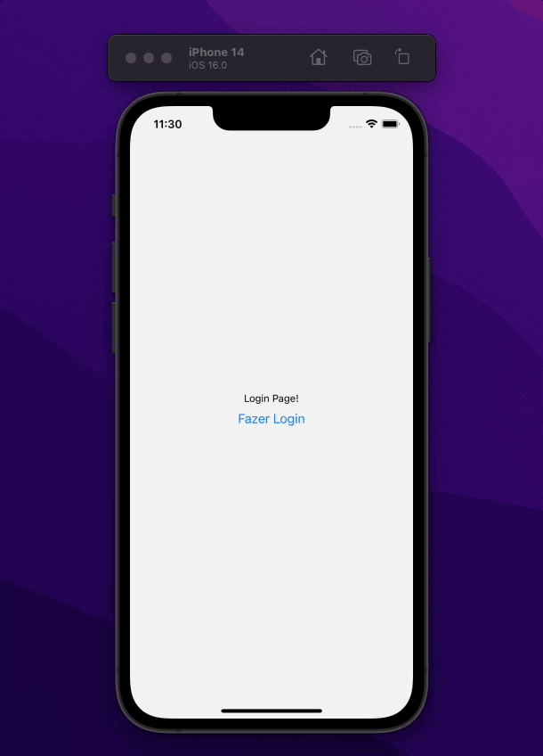

## Objetivo:

- Este projeto é uma POC para resolver um possível problema na utilização do Bottom Navigation e o Drawer Navigation na mesma tela
- Ao utilizar os 2 tipos de navegação, acontecem alguns conflitos pois as Screens não podem ter os mesmos nomes.

## Solução:

- Uma das formas encontradas, foram utilizar nomes diferentes e inserir manualmente o title de cada screen, tornando possível a utilização de ambas as navegções e ter títulos personalizados caso necessário.

## Executar o projeto:

- Fazer a instalação com `npm i` ou `yarn`
- Para executar o app no android: `npm run android` ou `yarn android`
- Para executar o app na versão IOS: `npm run ios` ou `yarn ios`

## Evidências:

## Tecnologias utilizadas:

- [Expo]
- [React Navigation]
- [Tab Navigation]
- [Drawer Navigation]
- [Stack Navigation]

### 📱 Social

Me acompanhe nas redes sociais:

   
  
  

---

Feito com ❤️ by **Lucca Rodrigues** 🤙
